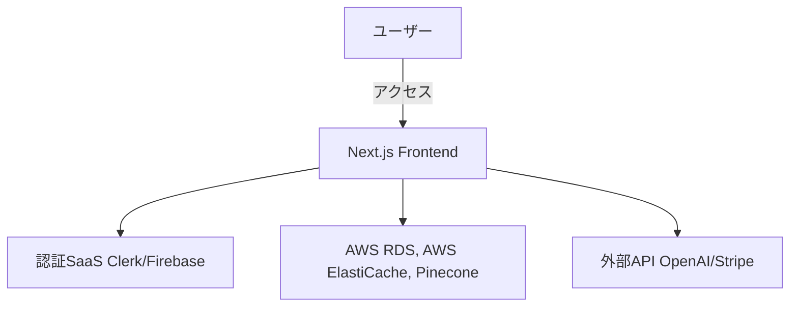

# 要件定義書

## 1. プロジェクト概要

### 1.1 プロジェクト名

- **「AI商品開発支援プラットフォーム(ラクション)」**

### 1.2 背景・目的

- **背景**:
  製造業の商品開発業務は、製造業の品質･コストの8割を決めると言われるくらい重要な上流工程であるにも関わらず、属人的でアナログなプロセスが多く、非常に非効率で生産性が低い。また、外部との繋がりも少ないため、イノベーションも起きづらい状況にある。
- **目的**:
  AI･データ活用や外部連携によって、商品開発者(企画者、設計者、関係各者)の無駄業務を無くし、メーカーの新価値創出と競争力強化を支援する。

### 1.3 システムのビジョン / スコープ

- **ビジョン**:
  製造業/商品開発領域のDX推進し、新規事業領域のDX、そして、新産業創出といった「商品開発/新価値創出」のNo.1プラットフォームを目指す。
- **スコープ**:
  本フェーズでは、以下を対象とします。
  - RAGシステム
  - データ(ファイル)管理機能
  - データ(ファイル)の自動前処理
  - AIチャットボット機能
  - 自動企画設計機能
  - 外部連携機能
  - アカウント管理･権限設定機能
  将来的には、商品･開発プロジェクト管理や他システムとの連携等、高度な機能を追加予定。

---

## 2. ビジネス要件

### 2.1 ビジネスモデル情報

- **ビジネスモデル**:
  月額課金制のSaaSモデル
- **市場規模 / 成長予測**:
  製造業の商品開発/DX投資は年々増加の成長市場

### 2.2 成果指標（KPI/KGI）

- 1年間で10社の契約を獲得。
- 開発業務20%効率化を達成

### 2.3 ビジネス上の制約

- **予算**: 月額5万円以内の運用コスト。
- **開発期間**： 1ヶ月でβ版リリース
- **法的要件**: 個人情報保護法やGDPRに準拠。

---

## 3. ユーザー要件

### 3.1 ユーザープロファイル / ペルソナ

- **対象ユーザー**:
  製造業の商品開発部門(企画部、設計部等)の担当者、マネージャーと各関係部署の担当者、マネージャー
- **課題**:
  属人化した非効率な開発業務フロー、過去のデータを活かせていない

### 3.2 ユーザーストーリー

1. 「設計者として、過去の参考情報を迅速に参照したい。なぜなら、今は多くの時間が掛かっていて、本来の創造的な業務の妨げになっているからだ。」
2. 「開発部門長として、QCDを向上したい、何故なら、高付加価値商品の短期開発が求められるようになってきているからだ」
3. 「開発者として、社外の情報をキャッチアップしたい、なぜなら、社内だけでは新しい商品のアイデアやイノベーションが生まれてこないからだ」

### 3.3 MVPの定義

- **MVP範囲**:
  - RAGシステム
  - データ(ファイル)管理機能
  - データ(ファイル)の自動前処理
  - AIチャットボット機能
  - 自動企画設計機能
  - 外部連携機能
  - アカウント管理･権限設定機能
- **ゴール**:
  初期リリースでユーザーの課題解決に寄与し、早期フィードバックを得る。

---

## 4. 機能要件

### 4.1 機能一覧 / MoSCoW分類

| 機能 ID | 機能名                  | 要約                           | 必須/任意 | MVP対象 |
| ------ | ---------------------- | ------------------------------ | ------- | ------- |
| F-001  | ユーザー認証             | メールアドレスとパスワードによる認証 | 必須     | Yes     |
| F-002  | データ(ファイル)管理      | 図面やドキュメントを一元管理        | 必須     | Yes     |
| F-003  | AIチャットボット機能      | 過去案件の類似検索、設計支援        | 必須     | Yes     |
| F-004  | 自動企画設計機能          | ERPや決済システムとの連携          | 必須     | Yes     |
| F-005  | 外部連携機能             | ERPや決済システムとの連携          | 必須     | Yes     |
| F-006  | アカウント管理･権限設定機能 | ERPや決済システムとの連携          | 必須     | Yes    |

### 4.2 機能詳細仕様

#### 4.2.1 `<機能 ID: F-001 ユーザー登録機能>`

- **概要**: 契約をしたユーザーはサービス提供者が管理者アカウントのIDとパスワードを発行し、利用できるようになる
- **ユースケース**: 「新規ユーザーが初めてサービスを利用するとき」
- **前提条件**: 事前に SaaS（Clerk / Firebase Auth など）が導入されている
- **正常系フロー**:
  1. サービス提供者が管理画面からユーザーアカウントのIDとパスワードを発行する
  2. ユーザーは発行されたIDとパスワードでログインをする

- **例外系フロー**:
  - 既に登録済みのメールアドレスの場合
  - パスワードが要件（8 文字以上など）を満たさない場合
- **UI 要件**:
  - 入力エラー時にはリアルタイムでエラー表示
  - 画面遷移せずにエラーメッセージを表示
- **非機能面注意**:
  - セキュリティ（暗号化通信、CSRF / XSS 対策）
  - レスポンス性能（3 秒以内に完了画面表示など）

> 他の機能についても同様の形式で記載

---

## 5. 非機能要件

### 5.1 パフォーマンス要件

- **レスポンス時間**: 主要画面は3秒以内。
- **同時接続数**: 10 ~ 1000 ユーザー。
- **処理量**: 1 社 1 日あたり 10,000 リクエストを想定

### 5.2 セキュリティ要件

- HTTPS通信の強制。
- 認証情報は暗号化して保存。
- **認証／認可**: Clerk などの外部認証サービスを利用、JWT トークン管理など
- **データ保護**: HTTPS 通信、個人情報の暗号化保存
- **監査ログ**: 管理者による不正アクセス／操作ログを記録
- **コンプライアンス**: 個人情報保護法、GDPR などに準拠

### 5.3 可用性・信頼性

- **稼働率**: 99.9%以上
- **障害時の復旧手順 / DR 対応**: バックアップ方針（頻度、保存期間 など）
- **フェイルオーバー**: 必要に応じてマルチリージョン対応を検討

### 5.4 ユーザビリティ / UI・UX

- **アクセシビリティ**: WCAG などのガイドライン考慮
- **多言語対応の有無**: 主に日本語、必要に応じ英語対応など
- **操作導線**: できるだけクリック数が少なくなる設計

### 5.5 スケーラビリティ

- **水平/垂直スケーリング**: クラウド環境（Vercel, AWS, etc.）のオートスケール
- **突発的アクセス増対策**: キャッシュ戦略、リトライ制御など

---

## 6. インテグレーション要件

### 6.1 外部サービス / SaaS 連携

- **認証系**: AWS Cognito
- **データベース系**: AWS RDS or Aurora, AWS ElastiCache, Pinecone
- **決済系**: Stripe
- **ストレージ系**: AWS S3
- **AI・ML 系**: OpenAI API, Claude, Gemini

### 6.2 API 仕様

- **提供・利用 API**: REST / GraphQL / gRPC など
- **エンドポイント例**:
  - `POST /api/register`
  - `GET /api/users/{id}`
- **HTTP メソッド**とリクエスト / レスポンスフォーマット（JSON, XML など）

### 6.3 データ連携要件

- **データ形式**: JSON, CSV 等
- **頻度**: リアルタイム or バッチ
- **再送制御**: 通信失敗時のリトライ制御など

---

## 7. 技術選定とアーキテクチャ

### 7.1 技術スタック

- **フロントエンド**: React / Typescript
- **バックエンド**: Node.js
- **データベース**: AWS RDS or Aurora, AWS ElastiCache, Pinecone
- **認証**: AWS Cognito
- **ホスティング / デプロイ**: AWS

### 7.2 アーキテクチャ概要

- **UI 層**: React
- **API 層**: AWS Lambda
- **DB 層**: AWS RDS or Aurora, AWS ElastiCache, Pinecone
- **外部連携**: Stripe, AWS S3, OpenAI API など

### 7.3 システム構成図

## 8. 開発プロセス / スケジュール

### 8.1 開発モデル・プロセス

- **アジャイル開発**的に開発し、MVPを短期間でリリース。
- フィードバックを迅速に収集し、継続的な改善を実施。

### 8.2 開発スケジュール

| フェーズ           | 期間         | 主なタスク                                    |
| ------------------ | ------------ | --------------------------------------------- |
| 要件定義           | 1週間        | ユーザーストーリー作成、MoSCoW分類の確定       |
| デザイン           | 1週間        | UI/UX設計、プロトタイプ作成                   |
| 実装（MVP）        | 2週間        | 基本機能（認証、データ統合、AI分析）の実装     |
| テスト             | 1週間        | 機能テスト、UIテスト、セキュリティ検証         |
| リリース＆検証     | 1週間        | β版公開、フィードバック収集、改善計画作成     |

---

## 9. リスクと課題

### 9.1 リスク一覧

| リスク内容                  | 影響度 | 発生確率 | 対策                                      |
| --------------------------- | ------ | -------- | ----------------------------------------- |
| 外部API連携の障害          | 高     | 中       | モック環境でのテスト、API仕様変更の監視    |
| 開発要員の不足              | 中     | 中       | 外部リソースの活用、優先度の見直し        |
| セキュリティ脆弱性          | 高     | 低       | 定期的なセキュリティ診断とパッチ適用      |

### 9.2 課題 / 前提条件

- チームメンバーのスキルセット強化（Next.js、PostgreSQL経験）。
- 予算内でのスケール可能な設計の確立。
- 外部APIのレート制限に対応するキャッシュ戦略。

---

## 10. ランニング費用と運用方針

### 10.1 ランニング費用の目安

- **SaaSコスト**: 
  - 認証（Firebase Auth）: 月額0～10ドル（無料枠含む）。
  - データベース（PostgreSQL on Neon）: 月額10～30ドル。
- **ホスティング**:
  - Vercelの無料プランを利用（初期段階）。

### 10.2 運用・保守体制

- **運用チーム**: 1 名 (開発者)
- **監視ツール**: Sentry、Datadogを導入。
- **アップデート頻度**: 月2回のリリースサイクル。
- **障害対応**: 障害発生時は1日以内に復旧作業開始。

---

## 11. 変更管理

- **変更管理プロセス**:
  - GitHubを活用してIssue管理。
  - Pull Requestによりレビューと承認を実施。
- **要件変更への対応**:
  - 優先度を見直し、チーム合意のもとで進行。
- **AIツールの活用**:
  - ChatGPTやCursorを利用したドキュメント更新と議事録作成。

---

## 12. 参考資料 / 関連ドキュメント

- システム要件一覧と設計資料（Notionに保存）。
- Firebase Auth、PostgreSQL、Vercelの公式ドキュメント。
- AI分析アルゴリズムに関するリファレンス（OpenAI API）。

---
